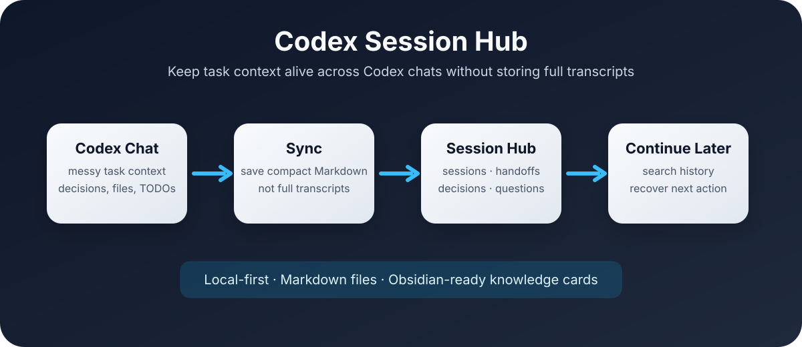
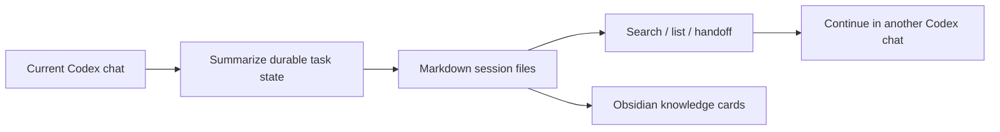

# Codex Session Hub

> Stop losing context across Codex chats.

Codex Session Hub is a local-first Codex skill for people who run several Codex tasks in parallel. It saves task state, decisions, open questions, handoffs, and Obsidian-ready knowledge cards as Markdown files, so a later Codex conversation can recover the work without reading your full chat history.



```text
current Codex chat → sync task memory → search later → continue in another chat
```

## Why this exists

Parallel Codex work creates a new kind of mess: one chat is editing code, another is researching, another is publishing to GitHub, and after a few hours you no longer know which thread contains the important decision. Session Hub turns useful conversations into small, readable task files.

It is intentionally boring: Markdown on your machine, no cloud database, no background transcript collector.

## What it saves

- **Task state** — current goal, progress, files, links, and next actions.
- **Decisions** — what was chosen and why.
- **Open questions** — issues that should not disappear when the chat changes.
- **Handoffs** — copy-paste prompts for continuing in a new Codex conversation.
- **Knowledge cards** — reusable lessons that can be written into Obsidian.

## Quick start

Copy the skill into your Codex skills directory:

```bash
mkdir -p ~/.codex/skills
cp -R skills/session-hub ~/.codex/skills/session-hub
```

Initialize the local hub:

```bash
python3 ~/.codex/skills/session-hub/scripts/session_hub.py init
```

Default storage locations:

```text
~/Documents/Codex/session-hub
~/Documents/Obsidian Vault/40-整理产出/Codex知识卡片
```

Optional custom paths:

```bash
export SESSION_HUB_ROOT="/path/to/session-hub"
export OBSIDIAN_KNOWLEDGE_DIR="/path/to/obsidian/cards"
```

## Use it in Codex

Say things like:

```text
同步当前对话到 session hub
生成这个任务的交接语
继续 GitHub 发布任务
查一下哪个任务提过 Obsidian 知识卡片
提取这段对话的知识到 Obsidian
```

The skill will summarize durable state instead of copying raw chat logs.

## Command-line helper

The helper script uses only the Python standard library.

```bash
# initialize folders
python3 skills/session-hub/scripts/session_hub.py init

# create a new session file
python3 skills/session-hub/scripts/session_hub.py new "GitHub 发布 Session Hub" --project codex-session-hub

# list sessions
python3 skills/session-hub/scripts/session_hub.py list

# search task memory
python3 skills/session-hub/scripts/session_hub.py search "GitHub"

# include Obsidian knowledge cards in search
python3 skills/session-hub/scripts/session_hub.py search "封面生成" --obsidian

# generate a handoff file
python3 skills/session-hub/scripts/session_hub.py handoff github-发布-session-hub
```

## Example output

A session file contains compact, recoverable task state:

```md
# GitHub 发布 Session Hub

## Current goal
Publish the local Codex skill as an open-source GitHub project.

## Progress
- README polished for public release.
- MIT license added.
- Remote repository created.

## Open questions
- [ ] Git credentials still need to be configured before pushing.

## Continue prompt
Please read this session file, confirm the current state, and continue from the next action.
```

See [`examples/example-session.md`](examples/example-session.md) for a fuller example.

## How it works



Initialized hub structure:

```text
~/Documents/Codex/session-hub/
├── index.md
├── open-questions.md
├── decisions.md
├── error-solutions.md
├── sessions/
├── handoffs/
├── knowledge/
└── logs/
```

## What it does not do

- It does not read every old Codex chat automatically.
- It does not store full transcripts.
- It does not upload your task memory to a cloud service.
- It does not try to be a full project-management system.
- It does not use vector search yet.

That boundary is deliberate. The first useful version should be easy to inspect, edit, and repair.

## Obsidian integration

Session Hub treats Obsidian as the durable knowledge layer:

- Task state and handoffs stay in Session Hub.
- Reusable methods, errors, and lessons can be extracted as Obsidian cards.
- Uncertain material can stay in task notes until it proves useful.

More details: [`docs/obsidian-integration.md`](docs/obsidian-integration.md)

## Project structure

```text
codex-session-hub/
├── .codex-plugin/plugin.json
├── AGENTS.md
├── LICENSE
├── README.md
├── assets/
│   └── session-hub-flow.svg
├── docs/
├── examples/
└── skills/
    └── session-hub/
        ├── SKILL.md
        ├── scripts/session_hub.py
        └── templates/
```

## Roadmap

- [ ] Add `update` command for safer task sync.
- [ ] Add `doctor` command for path and permission checks.
- [ ] Add duplicate detection for Obsidian knowledge cards.
- [ ] Add richer demo sessions and screenshots.
- [ ] Consider optional SQLite / local dashboard only after Markdown starts to hurt.

## Safety

Do not save tokens, cookies, API keys, passwords, private keys, `.env` contents, or raw private chat transcripts. Session Hub should record how to continue a task, not mirror your entire workspace.

## License

MIT.
